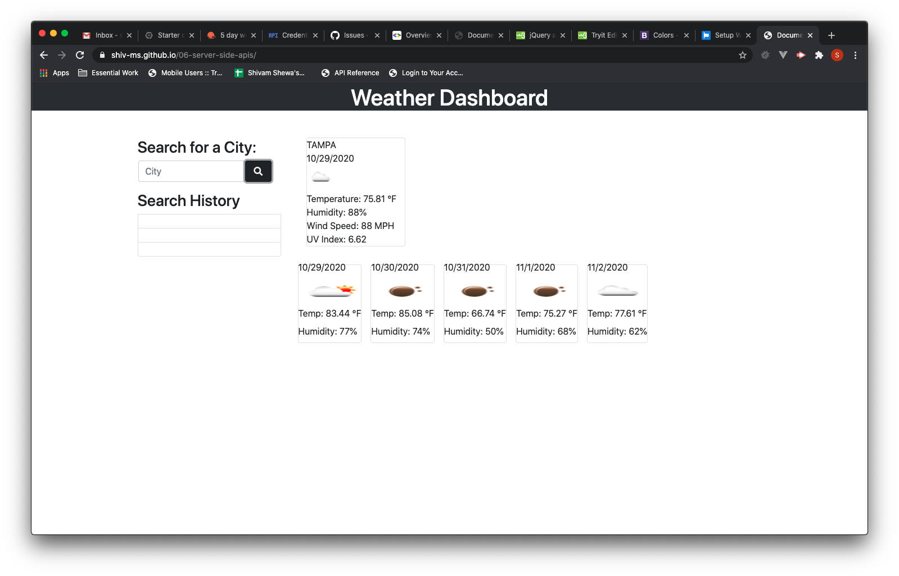

# 06-server-side-apis
## Weather Dashboard
## The Repository
This repository ("`06-server-side-apis`") is where my Weather Dashboard app resides [Code Quiz](https://shiv-ms.github.io/06-server-side-apis/).  The weather dashboard will be used to display real world weather data with all the information pulled from an API. The user will be able to search for the current and future days (up to 5.)
### The app must follow this criteria to satify the user needs
* WHEN you search for a city THEN you are presented with current and future conditions for that city and that city is added to the search history
* WHEN you view current weather conditions for that city THEN I you presented with the city name, the date, an icon representation of weather conditions, the temperature, the humidity, the wind speed, and the UV index
* WHEN you view the UV index THEN you are presented with a color that indicates whether the conditions are favorable, moderate, or severe
* WHEN you view future weather conditions for that city THEN you are presented with a 5-day forecast that displays the date, an icon representation of weather conditions, the temperature, and the humidity
* WHEN you click on a city in the search history THEN you are again presented with current and future conditions for that city
* WHEN you open the weather dashboard THEN you are presented with the last searched city forecast
# Weather Dashboard desktop View:

  

